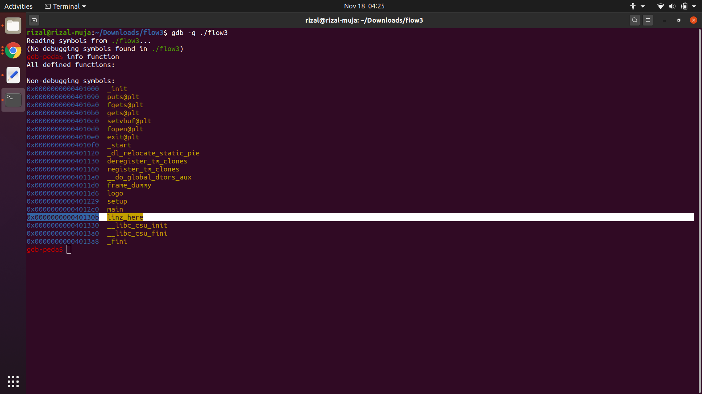
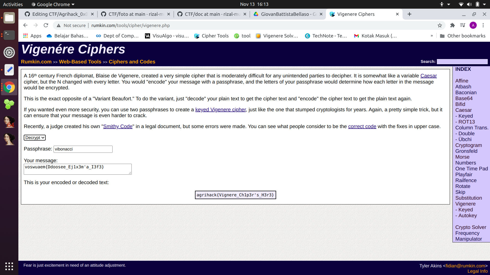

# Agrihack 0x05

Agrihack merupakan Ajang untuk penyeleksian menjadi anggota CSI(Cyber Security IPB). CSI merupakan komunitas yang berada di ilmu komputer yang berprestise di ilmu komputer IPB

## Binary 
### 1. Flow1
dengan melihat urutan stacknya yang bersebelahan, <br/><br/>
<br/><br/>
kita timpa saja yah melebihi si __buffernya__ 
<br/><br/><br/><br/>
flag : `agrihack{Toooooooooo_much_character_is_dangerous_LINZ_IS_HERE}
`<br/><br/> [sumber file](https://ipb.link/flow1)<br/>netcat : `nc 52.187.65.2 17001` 

### 2. Flow2

<br/><br/>dengan melihat ```modified == 0x04170417``` 
maka kita bisa memodifikasi dengan setelah ``` 64*'A' (buffer) + '\x17\x04\x17\x04'(modified)``` maka terjadilah seperti
<br/><br/>

<br/><br/>
flag : `agrihack{U_CAN_CONTROL_THE_VALUE_NOW!!!_LINZ_IS_HERE}` <br/><br/> [sumber file](https://ipb.link/flow2) <br/>netcat : `nc 52.187.65.2 17002` 

### 3. Flow3

<br/><br/>dengan melihat fungsi ```int linz_here(){
  printf("%s\n", flag);
}``` 
maka kita mencari alamat dari linz_here(). Sebelum itu kita meng-_compile_ terlebih dahulu <br/><br/> <br/><br/>
kemudian kita __debugging__ dengan menggunakan dengan [gdb peda](https://github.com/longld/peda)
<br/><br/> <br/><br/>
dengan melihat dan memahami dari [overwrite return address](https://www.youtube.com/watch?v=Oyw_i8L3t8c) maka payloadnya adalah<br/><br/> <br/><br/>
flag : `agrihack{jump_to_anywhere_with_overflow_LINZ_IS_HERE}` <br/><br/> [sumber file](https://ipb.link/flow3) <br/>netcat : `nc 52.187.65.2 17003` 

### 4. String1
dengan menggunakan writeup dari [sini](https://tcode2k16.github.io/blog/posts/picoctf-2018-writeup/binary-exploitation/#problem-6) maka saya langsung aplikasikan di ipython3<br/><br/><br/><br/><br/><br/>
flag : `agrihack{u_can_leak_some_information_from_format_string_attack_LINZ_IS_HERE}`
<br/><br/>
[file c](https://agrihack.codepwnda.id/uploads?key=3fcbba194ca222fede26a344c175a4abbe5d6d467405e41aa46b373335c444e6%2Ffmt.c)
[file ELF](https://agrihack.codepwnda.id/uploads?key=6265761bee9c4f4d0227f68918c51f2f8af3e6fb6bfd0260e6ab7e4f9b5d787a%2Fchall)


## Crpytography
### 1. Base64
[file](https://drive.google.com/drive/folders/1WUNUQX8EpcEXnz9HMS59zdoqlzx1rM65?usp=sharing) ini dengan isinya `YWdyaWhhY2t7YmFzaWNfdG9fa25vd19iYXNlNjR9`. DIkarenakan judulnya itu base64 maka bisa kita di dekripsi dengan [tools](http://rumkin.com/tools/cipher/base64.php) ini maka hasilnya

adalah <br/>
```agrihack{basic_to_know_base_64}```

### 2. crypto/Introduction to Cipher_Series : ROMAN
dikarenakan didalam foto tersebut ada data foto caesar.png yang ada kluenya dengan menggunakan _caesar cipher_ maka dengan [tools](http://rumkin.com/tools/cipher/caesar.php) ini dan teks `rxizyrtb{Xrzlj_Alczlj_Trvjri}` maka akan menghasilkan ```agrihack{Gaius_Julius_Caesar}``` <br/> <br/>
<a href="https://drive.google.com/file/d/1NwgB5Bzkb8AO0z2aSKYhHjzew92FbtH1/view">caesar.png</a>

### 3. Introduction to Cipher_Series : GiovanBattistaBellaso
dengan meninjau dan memahami gambar dari foto ini <br/><br/>
<br/><br/>
dan mencari tahu bahwa dia adalah [penemu vighere cipher](https://en.wikipedia.org/wiki/Giovan_Battista_Bellaso) dan dengan gambar kunci tersebut adalah `key :"vibonacci"`<br/>
`ciphertext :voswuaem{Ddoosee_Ej1x3m'a_I3f3}`
maka dengan [website ini](http://rumkin.com/tools/cipher/vigenere.php) maka ketemulah flagnya yakni
<br/><br/>

<br/><br/>
flag : `agrihack{Vignere_Ch1p3r's_H3r3}`
[sumber file](https://drive.google.com/drive/folders/1oYDRwOURZPEL9frLmw45Nje_o428Wuce)
### 4. Introduction to Cipher_Series : Talking
lihatlah kata kunci dari hint tersebut `'numbers come after letters, underscore come after numbers'` maka anda akan terkejut dengan ini karena sangat mudah untuk dipecahkan dengan hint ini maka saya akan membuatnya di [notepad](doc/talking_cipher) awal mulanya saya mencurigai `1 7 18 9 8 1 3 11` yang dikonversikan menjadi `agrihack` , maka saya langung mengkonversikan yang lain dan dengan petunjuk hint juga ya maka akan menjadi [ini](doc/boooo.txt)
<br/>
<br/>

<br/>
<br/>
[sumber filenya](https://drive.google.com/drive/folders/1sO9aU4fKPLcuhQQEV5FHfdIU6D3VbqmP?usp=sharing)
### 5. BabyXOR
dengan mengikuti saran dari youtube [csi ipb](https://www.youtube.com/watch?v=-elQW05sgV8) dan dikarenakan dari pembuat soal tersebut terinspirasi dari _cyber jawara_ maka kita bisa mengubah UTF-16 menjadi UTF-8 dengan hexdump dan jadikan little endian <br/> <br/>  <br/><br/>
dan saya olah dengan sistem babyxor di [python](doc/babyxor.py)<br/><br/>
<br/>
`agrihack{you've_learn_about_xor_______let's_moving_on}`
[sumber file](https://drive.google.com/drive/folders/18USKvC3aPP1GaG8-M5ZSF5iizZvKp_jj?usp=sharing)
### 6. Password Cracker
dengan hash MD5 `0f7c017187ad3c1d50a65015de71958c` maka dengan [crack ini](https://crackstation.net/)<br/><br/>

<br/><br/>
kemdian tinggal kita masukkan passwordnya `b33f` ke `nc 52.187.65.2 15001`
<br/><br/>

<br/><br/>
`agrihack{brut3f0rc3333_as_1t5_f1n33______b33f}`
### 7. Introduction to Cipher_Series : Matrix
dengan foto seperti <br/> <br/>

 <br/> <br/>
maka dengan menyamakan konsep dari soal sebelumnya dari Talking maka akan menjadi seperti [ini](doc/matrix.txt) <br/>
`flag : agrihack{C0lumn4t_Tr4nsp051t1000N}`
<br/>
[sumber_file](https://drive.google.com/drive/folders/1UskrfztjMhYbpp7c3ZEYMTfNMpHh0ori?usp=sharing)
### 8. BabyAES : Introduction
dikarenakan ada bacaannya enkripsi 3x maka yang pertama adalah dengan dekripsi seperti _cyber jawara seperti enc.txt di babyxor_ maka saya lakukan hexdump dan mendapatkan ciphernya<br/><br/>

<br/><br/>

<br/><br/>
kemudian saya melihat terlebih dahulu sourcenya dan ketemulah kuncinya buat AES
<br/><br/>

<br/><br/>
dan saya olah dengan [tools ini](https://www.devglan.com/online-tools/aes-encryption-decryption) 
<br/><br/>

<br/><br/>
dikarenakan menghasilkan ciri ciri base64 dan saya konvertkan menjadi ascii dan hasilnya adalah ...
<br/><br/>

<br/><br/>
flagnya adalah `agrihack{51mpl3_ECB_MODE_34b6a5}`
[source.py](https://agrihack.codepwnda.id/uploads?key=1e137ba830987af7dd616a5761de8910f2bcc4fc7c0ab1242b51943f91954263%2Fsource.py)[enc.txt](https://agrihack.codepwnda.id/uploads?key=4ac3ed117c61d638505b36882a34a034ff596e4bff50fef3db5549db1f382e4b%2Fenc.txt)
### 9. Password Cracker 2
sama seperti Password Cracker dengan menggunakan [tools ini](https://crackstation.net/) dan kita crack `535fc078a3a273070809bfdbef6018bf`
<br/><br/>

<br/><br/>
dan masukkan saja ke terminal `nc 52.187.65.2 15002`
<br/><br/>

<br/><br/>
dan hasilnya adalah
flag : `agrihack{d0n7_u53_w34k__p455w000000RD}`

### 10. crypto/BabyXor Vol.2
dengan materi yang dikirim dari channel CSI IPB youtube tentang [xor cipher repeated](https://www.youtube.com/watch?v=-elQW05sgV8) dengan tools [xortool](https://github.com/hellman/XORTOOL) <br/>

berikut ini adalah walkthroughnya
<br/><br/>

<br/><br/>

<br/><br/>
kita cek masing masing hasilnya yang berbentuk _*txt*_ ya . bukan yang berbentuk bin
<br/><br/>

<br/><br/>
maka ketemulah flag : `agrihack{common_character__is_space}`<br/><br/>
[sumber file](https://agrihack.codepwnda.id/uploads?key=f037303d30444fff4a69c6c23bbef4fae687ed793c827e24e63d1fada339b077%2Fenkrip.enc)

### 11. Password Cracker 3
hash : `29f1f8b054a15638a1a269a0f4b0d743`<br/>
salted : `secret_`<br/>
dengan [tools ini](https://www.dcode.fr/md5-hash) saya bisa mendekripsi hash tersebut 
<br/><br/>

<br/><br/>

<br/><br/>
flag : `agrihack{R0ck_y0u_1s_4_th1ng55____b33f}`<br/>
dengan netcat `nc 52.187.65.2 15003`

## Misc 
### 1. Mesin Hitung
kita lihat dulu bagaimana pola pada netcat itu sendiri <br/><br/>

<br/><br/>
kemudian dengan bantuan script dari [website CSI IPB](https://www.youtube.com/watch?v=9y1Akw_JBIg&t=2023s) maka saya membuat code seperti ini <br/><br/>

<br/><br/>
```
from pwn import *    
def penjawab(persa):   
	if(persa.find(' + ')!=-1):   
		patokan = persa.find(' + ')    
		kiri = int(persa[0:patokan],10)   
		kanan= int(persa[patokan+3:],10)  
		hasil = str(kiri+kanan)  
		return hasil 
	if(persa.find(' - ')!=-1):   
		patokan = persa.find(' - ')    
		kiri = int(persa[0:patokan],10)   
		kanan= int(persa[patokan+3:],10)  
		hasil = str(kiri-kanan)  
		return hasil  
	if(persa.find(' * ')!=-1):   
		patokan = persa.find(' * ')    
		kiri = int(persa[0:patokan],10)   
		kanan= int(persa[patokan+3:],10)  
		hasil = str(kiri*kanan)  
		return hasil  
	if(persa.find(' / ')!=-1):   
		patokan = persa.find(' / ')    
		kiri = int(persa[0:patokan],10)   
		kanan= int(persa[patokan+3:],10)   
		hasil = str(kiri//kanan)  
		return hasil   
    
p = remote('52.187.65.2',15009)   
p.recvuntil('hehe\n')   
persamaan = str(p.recvline(),'utf-8')    
answer = penjawab(persamaan)   
p.recvuntil('Jawaban : ')   
p.sendline(answer)  
   
for i in range(999):  
	p.recvuntil('BENAR\n')    
	persamaan = str(p.recvline(),'utf-8')     
	answer = penjawab(persamaan)    
	p.recvuntil('Jawaban : ')    
	p.sendline(answer)   
	
penjawab = p.recv()  
print(penjawab) 
```

maka saya ketemu flagnya yakni : `agrihack{tambah_kali_bagi_kurang_bb7b3d}`
sumber netcat :`nc 52.187.65.2 15009`

### 2. Bintang Jago
kita langsung saja dengan pengaplikasian <br/><br/>

<br/><br/>
flag :`agrihack{import_bintang_PWN_56ba5fc}`
sumber netcat : `nc 52.187.65.2 15008`

## Reverse
### 1. Baby-C-0x00
pertama kita analisis dulu datanya itu ELF 32 bit / 64 bit 
<br/><br/>

<br/><br/>
dengan menggunakan IDA PRO 64 bit maka langsung ketemu jawabannya
<br/><br/>

<br/><br/>
maka akan ketemu flagnya <br/>
flag : `agrihack{yeah_this_is_easier_than_C_0x??_series}`<br/>
[filenya](https://agrihack.codepwnda.id/uploads?key=9022906aba13af92bae0c80489ecbd2b3f8b5a12154e89ab8c222099ece4fdc3%2Fbaby-c-0x00)
atau [file](doc/baby-c-0x00)

### 2. Baby-C-0x01
kita analisis filenya 32 bit atau 64 bit 
<br/><br/>

<br/><br/>
kemudian kita disassembly dengan IDA PRO dan copy di text editor
<br/><br/>

<br/><br/>
dan lihatlah ada istilah [rbp-30h] dikarenakan selisihnya hanya 1 . maka kita menyimpulakan s, v5-v19 adalah tipe data __char__ -> maka sebenarnya s adalah __array of char__ 
<br/><br/>

<br/><br/>
kemudian kita masukkan nilainya dan menghindari percabangan agar command __exit__ tidak dilakukan 
<br/><br/>

<br/><br/>
dan jadilah ketemulah flag <br/>
flag : `agrihack{whoaaa_u_find_me}`<br/>
[filenya](doc/baby-c-0x01)

### 3. C-0x00
langsung saja kita analisis dengan command file dan kita langsung lihat saja ke IDA PRO
<br/><br/>

<br/><br/>
disitu kita lihat bahwa inputan kita dibagi 2 ```if ( 2 * s[v4] != *((_DWORD *)&arr + v4) )``` dan batasan inputan kita adalah 20 dari ```if ( strlen(s) != 20 )```<br/>
kemudian dikarenakan diminta dari alamatnya dari __arr__ maka saya akan men-__debug__ dengan gdb dan hasilnya adalah seperti ini
<br/><br/>

<br/><br/>
dan kita code dengan membagi 2 dan menjadikan character
<br/><br/>

<br/><br/>
dan kita masukkan kedalam ELF-nya dan jadilah seperti ini
<br/><br/>

<br/><br/>
flag : `agrihack{welcome_to_reversing}`<br/>
[filenya](doc/c-0x00)

### 4. python-0x00
pertama kita decompile terlebih dahulu `pyc -> py` dengan menggunakan [uncompyle6](https://pypi.org/project/uncompyle6/) 
br/><br/>

<br/><br/>
dan kemudian kita analisis code agar inputannya menghasilkan flag
<br/><br/>

<br/><br/>
dan langsung dapatkan lah flagnya
<br/><br/>

<br/><br/>
flag : `agrihack{dec0mpile_pyc_bytc0de_9adj3}`<br/>
[file](doc/py-0x00.pyc)

### 5. C-0x01
pertama yang tentu saja kita analisis data dengan command __file__<br/>
kemudian kita lihat saja di IDA PRO dan langsung saja kita analysis dan perhatikan kalimat yang diapit tanda `""" `<br/>
disitu ada arr1 dan arr2<br/>
arr1 itu buat __ganjil__<br/>
arr2 itu buat __genap__
<br/><br/>

<br/><br/>
kemudian kita cari __alamat dari arr1 dan arr2__ dari bantuan gdb peda 
<br/><br/>

<br/><br/>
dan langsung saja kita compile dan run untuk menghasilkan string tersebut
<br/><br/>

<br/><br/>
dan kemudian langsung kita temukan flagnya dari [file tersebut](doc/c-0x01)
<br/><br/>

<br/><br/>
ketemu flag : `agrihack{nic3_analysis_k0walsk1}`
<br/>[sumber file](doc/c-0x01)

### 6. C-0x02
seperti biasa tinggal kita `file`__-kan__ dan langsung saja kita ke IDA PRO 
<br/><br/>

<br/><br/>
dan langsung saja di analisis  ```if ( s[0] * v4 != 9559 || s[0] > v4 )``` 
<br/><br/>

<br/><br/>
disitukan bahwa ``` printf("key: ");__isoc99_scanf("%d", &v4);``` berarti bahwa v4 adalah key. dan kita mencari keynya terlebih dahulu<br/>
<br/><br/>

<br/><br/>
dan kemudian kita cari __&arr --- &arr+23__ dengan menggunakan peda
<br/><br/>

<br/><br/>
dan akhirnya kita olah dengan __pwntools__ maka  dan kita olah dari alamat &arr
<br/><br/>

<br/><br/>
maka flag:`agrihack{camellia:"makasih_udah_bukain_komputer_aku<3"}`<br/>
sumber netcat : `nc 52.187.65.2 17010` [sumber file](doc/c-0x02)

### 7. C-0x03
langsung saja ke IDA PRO yah. dan kemudian yang mencurigakan ada fungsi ``` print_flag()```
<br/><br/>

<br/><br/>
kemudian kita copy dan kita gunakan python untuk mendapatakan flag dan kita wrap ke format `agrihack{}`<br/>
<br/><br/>
.png)
<br/><br/>

<br/><br/>
dan ketemulah flag : `agrihack{weh_kok_ngecheat__}`
<br/>
[sumber file](doc/c-0x03)

### 8. C-0x04


## Web
### 1. Inception
Dengan membuka website ini dan kita langsung saja *menginspect* websitenya dikarenakan adanya foto ini. (ingat kalau di chrome tekan `F12`)<br/><br/><br/>
<image src="foto/inspect_me.png" width="1000px" height="500px" style="margin :40px 20px;">
<br/><br/><br/>
maka akan menemukan flag seperti berikut <br/><br/><br/>

Sumber website
<br/>`http://52.187.65.2:16000/` <br/>
flag : `agrihack{u_are_an_inspector!_LINZ_IS_HERE}`

### 2. X-header
dikarenakan sudah jelas yang dicari adalah X-header maka tinggal kita inspect -> Network dan temukan X-Header-nya 
<br/>
<br/>
<br/>

<br/>
<br/>
flag : `agrihack{x-header_header_tersembunyi_LINZ_IS_HERE}`<br/>
website : `http://52.187.65.2:16007/`

### 3. Bipbip
ada kluenya yaitu `Mr.Robot : "Beep...Beep..Beepp"` maka saya mencari di google mengenai robot di website [ini](https://www.robotstxt.org/robotstxt.html) maka saya aplikasi website `http://52.187.65.2:16001/` dengan menambahkan `robots.txt` menjadi `http://52.187.65.2:16001/robots.txt` dengan hasil <br/>
<br/><br/>

<br/><br/>
dan kemudian dengan directorynya yakni `/linz-is-here` maka saya buka website `http://52.187.65.2:16001/linz-is-here` <br/><br/>
<br/><br/>
flagnya `agrihack{robootssssssss_a_little_information_linz_is_here}`

### 4. Chef
Dengan menginspect dan melihat cookienya maka kita bisa melihat ada cookie ,
<br/><br/>

<br/><br/>

<br/><br/>
jadinya bisa diganti cookienya dari `user = juna` menjadi `user = admin` dan ,<br/>,<br/>
jadilah seperti ini 
<br/><br/>

<br/><br/>
maka jadilah flag : `agrihack{chef_cookie_cook_xdxdxd_LINZ_IS_HERE}`
<br/><br/>
[sumber website](http://52.187.65.2:16003/)

### 5. Kingsman
pertama saya cek dahulu dengan `http://52.187.65.2:16002/robots.txt` dan ketemulah User-Agent yang lain dengan `Kingsman Agent 0x05`  dan kita akan membuka `/agent-exam` dengan user-agent tersebut 
<br/><br/>

<br/><br/>
kemudian saya hasil nya seperti ini
<br/><br/>

<br/><br/>
[cara menganti user agent](https://winpoin.com/cara-mengganti-user-agent-di-google-chrome-tanpa-add-on/)<br/><br/>
dapatlah flagnya yakni : `agrihack{ur_now_our_agent0x05_linz_is_here}`
<br/>
[sumber website](http://52.187.65.2:16002)

### 6. Redirect
Saya mencari cari writeup yang lain , kemudian saya menemukan _writeup_ [__improper redirect__](http://2101704584farras.blog.binusian.org/2019/06/20/http-improper-redirect/) maka saya saya akan men-_curl_-kan dengan command `curl` maka hasilnya adalah 
<br/><br/> 

<br/><br/> 
flag : `agrihack{R3d1reCt_N0__r3dIrEcT!ng___x999699}`
<br/>[sumber website](http://52.187.65.2:16004)

### 7. LSI
dengan menggunakan menonton Youtube kesayangan Kita yakni [CSI IPB mengenai LFI](https://www.youtube.com/watch?v=h-2UrETGKFg&t=563s) dan kemudian saya ikuti dan mengganti untuk mencari flag karena _*flagnya berbentuk file flag.php*_<br/><br/>

<br/><br/>
yah tinggal di deksripsi saja yah base 64
<br/><br/>

<br/><br/>
flagnya adalah `agrihack{OOPSIEEE!!!_Ketauandehfilerahasianya_LINZ_IS_HERE}`
<br/>
[sumber website](http://52.187.65.2:16005)

### 8. LSI2

dengan menggunakan menonton Youtube kesayangan Kita yakni [CSI IPB mengenai LFI](https://www.youtube.com/watch?v=h-2UrETGKFg&t=1138s) dan kemudian saya ikuti dan mengganti untuk mencari flag karena _*flagnya berbentuk file flag.php*_<br/><br/>

<br/><br/>
dan tinggal kita susuri aja dengan `home/sercretfilehere/flag.php`
<br/><br/>

<br/><br/>
flagnya adalah `agrihack{LSI_GALI_TERUS_SAMPAI_DALAM_LINZ_IS_HERE}`
<br/>
[sumber website](http://52.187.65.2:16006)

### 9. Admin 
maafkan saya , saya hanya mengerti ini dengan menggunakan tools [__sqlmap__](http://sqlmap.org/). dan saya menerapkannya melalui [link ini](https://medium.com/sadulur/mengambil-database-di-web-melalui-sql-map-di-kali-linux-56f65b639f4a) dan hasilnya seperti ini ya <br/><br/>

<br/><br/>
untuk mendapatkan table,jangan lupa menuliskan `--forms` dikarenakan querynya berbentuk __form__ dan __action-nya POST__ 

<br/><br/>
setelah mendapatkan database, tinggal kita kunjungi saja
<br/><br/>

<br/><br/>

<br/><br/>
setelah mendapatkan tablenya , tinggal kita `dump`
<br/><br/>

<br/><br/>

<br/><br/>
dan tinggal kita masukkan saja akun admin dikarenakan sudah ada password ke websitenya
dan ketemulah flagnya
<br/><br/>
[](foto/admin_flag.png)
<br/><br/>flagnya : `agrihack{ez_SeQueL_Inj3kxx1on_}`
[sumber website](http://52.187.65.2:16009)

### 10. Data Breach
sama dengan yang diatas ini tinggal pake sqlmap coba,latihan dulu sebelum melihat kunci jawabannnya
<details>
<summary>Jawabannya adalah</summary>
<br/><br/>ini commandnya : <b>sqlmap -u http://52.187.65.2:16010/ --forms --dbs -D databreach -T secret -dump </b><br/><br/>

<br/><br/>

<br/><br/>
flag : <b>agrihack{SQLi_lead_to_data_breach_and_it_is_very_DANGER!!!!!_LINZ_IS_HERE}</b>
</details>
[sumber website](http://52.187.65.2:16010/)
a
